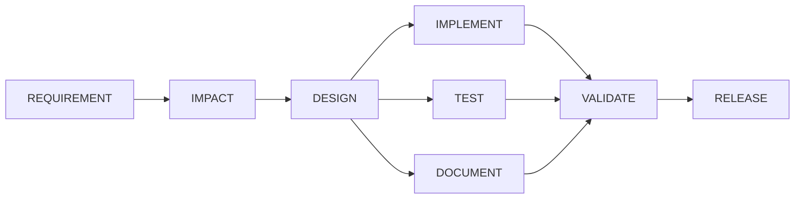

# Agentic Software Engineering System

An orchestrator that drives a requirement through the full SDLC under governance: an
explicit dependency graph, entry and exit gates per stage, bounded retries, rollback,
policy guardrails, and an audit log of every decision. The URL shortener under
`target-service/` is the codebase it operates on, not the point of the submission. The
orchestration layer is the deliverable; read `orchestrator/` first.

**The one design principle:** agents propose, deterministic code decides. An LLM writes
specs, code, tests and docs. The orchestrator owns the dependency graph, the gates, the
policy, the retries, the approvals and the audit. Nothing an agent says is trusted; every
claim is checked by code that runs.

## Quickstart (no API key, no Docker, no network)

```bash
git clone <repo> && cd Agentic-Software-Engineering-System
./scripts/run.sh greenfield --replay --auto-approve --run-id DEMO
cat runs/DEMO/state.json
```

This builds the orchestrator with `javac` only, then runs a real two-node pipeline
(REQUIREMENT then DOCUMENT) against pre-recorded fixtures under `fixtures/`, with no
network call and no `ANTHROPIC_API_KEY` required. It ends `COMPLETED` and writes
`runs/DEMO/state.json`, `runs/DEMO/audit.jsonl`, and the real artifacts each node
produced under `runs/DEMO/artifacts/`.

To see the orchestrator's stricter, full eight-node governance graph (the one the three
named scenarios below actually run against), pass a later `--workflow` flag, which wins
over the one `run.sh` already sets:

```bash
./scripts/run.sh greenfield --replay --auto-approve --run-id DEMO-STRICT \
  --workflow "$(pwd)/workflows/sdlc-default.json"
```

## Architecture, in one picture



Every node is entry-gated (its dependencies and any policy check must clear before it
starts), executed by a real agent call or a real command, exit-gated against what it
actually produced on disk, retried up to a bounded limit on failure, checkpointed and
rolled back on a policy denial, and recorded as an immutable audit event. See
[docs/design.md](docs/design.md) for the full architecture, testing approach,
limitations and trade-offs in one document.

## The three scenarios

All three currently reach the same real, honest result on the strict eight-node graph:
REQUIREMENT's first attempt calls a real agent (in replay mode, served from a recorded
fixture), finds genuine unanswered questions in the requirement text, and correctly fails
its exit gate rather than inventing an answer. That failure is the designed behavior, not
a bug: a requirement executor that filled the gap itself would be exactly the "agent
grades its own work" shortcut CLAUDE.md rule 2 forbids. The retry that follows then hits a
stale fixture (recorded before a later fix changed the retry-reason text), which is a
real, credit-blocked limitation, documented below and in
[docs/design.md](docs/design.md), not hidden.

| Scenario | Real terminal status | Committed run | What it proves |
|---|---|---|---|
| `greenfield` | `SAFE_STOPPED` at REQUIREMENT, real open-questions gate failure | [runs/GREENFIELD-DEMO/](runs/GREENFIELD-DEMO/) | A requirement executor that will not paper over a real gap in the spec. |
| `brownfield` | `SAFE_STOPPED` at REQUIREMENT, same real gate failure pattern | [runs/BROWNFIELD-DEMO/](runs/BROWNFIELD-DEMO/) | The same governance holds on a codebase-reasoning scenario, not just greenfield. |
| `ambiguous` | `SAFE_STOPPED` at REQUIREMENT, 7 real open questions detected | [runs/AMBIGUOUS-DEMO/](runs/AMBIGUOUS-DEMO/) | Ambiguity detection surfaces the most unresolved questions of the three, as intended. |
| policy denial (no scenario, standalone) | `SAFE_STOPPED`, real `POLICY_DENIED` audit event | [runs/POLICY-DENIAL-DEMO/](runs/POLICY-DENIAL-DEMO/) | A node that writes outside its declared `writePaths` is denied and rolled back for real, no agent call involved. |

Each committed run under `runs/` contains the real, persisted `state.json`, an
`audit.jsonl` (one JSON object per line, derived directly from `state.json`'s own
`auditLog`, since the orchestrator persists the audit log embedded in `state.json` and
has no separate `audit.jsonl` writer), `approvals.json`, and any artifacts the run
actually wrote before it stopped. Nothing in this table describes a run that has not
happened; see [docs/design.md](docs/design.md)'s limitations section for exactly why the
two-stage `approval-demo.json` graph (used by the quickstart above) reaches `COMPLETED`
while the strict `sdlc-default.json` graph these scenarios use does not.

## The twelve capabilities (assignment section 4.4), plus re-planning

One row per capability: the file that implements it, and the specific test that proves
it, verified by reading the source, not inferred from a name. Where a test is noted as
proving the *mechanism* rather than a constant, it is one that fails if the mechanism is
removed or bypassed, which is the strongest evidence this repo has for that row.

| # | Capability | Implementing file | Proving test |
|---|---|---|---|
| 1 | Explicit dependency graph between stages | [orchestrator/src/main/java/com/schwab/agentic/graph/WorkflowGraph.java](orchestrator/src/main/java/com/schwab/agentic/graph/WorkflowGraph.java) (topological order, `readyNodes`) | `WorkflowGraphTest.testReadyNodesAfterDesignCompletesReturnsImplementTestAndDocumentTogether` |
| 2 | Entry and exit gates per stage | [orchestrator/src/main/java/com/schwab/agentic/engine/Gates.java](orchestrator/src/main/java/com/schwab/agentic/engine/Gates.java), invoked from `WorkflowEngine.admitReadyNodes` (entry) and `evaluateExitGate` (exit) | `WorkflowEngineTest.testExecutorSucceedingButExitGateFailingEndsAsFailedNotCompleted` (exit gate overrides the executor's own success claim); entry-gate blocking is exercised by `WorkflowGraphTest`'s `readyNodes` tests |
| 3 | Sequential and parallel execution paths with synchronization | [orchestrator/src/main/java/com/schwab/agentic/engine/WorkflowEngine.java](orchestrator/src/main/java/com/schwab/agentic/engine/WorkflowEngine.java) (`executeWaveAndWaitForAll`) | `WorkflowEngineTest.testThreeParallelNodesAllReachCompletedBeforeTheJoinNodeStartsAndAuditLogProvesIt` |
| 4 | Cross-stage context preservation | `WorkflowEngine.withInitialContext` (`initialContextByNodeId`), wired in [orchestrator/src/main/java/com/schwab/agentic/cli/Main.java](orchestrator/src/main/java/com/schwab/agentic/cli/Main.java) | `MainCliResumeTest.testRunApproveAndResumeEachCrossARealProcessBoundaryAndTheRunCompletes`, currently passing. `MainCliFullPipelineTest.testRunReachesCompletedWithAllEightNodesCompletedAcrossARealCliSubprocess` is the stronger, full-eight-node proof of this same mechanism, but is currently failing for a reason unrelated to context threading itself (a stale post-spec-07 fixture, see [docs/design.md](docs/design.md) section 3.2), not a regression in the mechanism this row claims |
| 5 | Decision lineage | [orchestrator/src/main/java/com/schwab/agentic/model/DecisionRecord.java](orchestrator/src/main/java/com/schwab/agentic/model/DecisionRecord.java), recorded via `WorkflowState` | `DesignExecutorTest.testDesignProducesArtifactsAndRecordsADecisionWithARejectedAlternative` |
| 6 | Human approval checkpoints | `WorkflowEngine.approve`/`deny`, gated by `RealPolicyEngine`'s `critical-risk-requires-approval` and `high-risk-requires-approval` rules | `WorkflowEngineTest.testApprovedNodeReturnsToPendingBeforeRunningNeverDirectlyFromWaitingApproval` |
| 7 | Bounded retries | `WorkflowEngine.runAttemptsUntilOutcome` | `WorkflowEngineTest.testNodeRetriedExactlyMaxAttemptsTimesThenTransitionsToFailed` |
| 8 | Fallback paths | `WorkflowEngine.runFallback` | `WorkflowEngineTest.testFallbackPathExecutesAndProducesADifferentArtifactThanTheRetryWould` |
| 9 | Rollback | `WorkflowEngine.rollBackAndFail`, restoration in [orchestrator/src/main/java/com/schwab/agentic/engine/Checkpoint.java](orchestrator/src/main/java/com/schwab/agentic/engine/Checkpoint.java) | `WorkflowEngineTest.testRollbackRestoresAModifiedFileAssertedByReadingItBackNotTheAuditLog` (verifies by reading the real file back, not by trusting the audit log) |
| 10 | Safe-stop | `WorkflowEngine.decideOutcomeWithNothingToRun` (`SAFE_STOPPED` branch) and the iteration guard in `run()` | `WorkflowEngineTest.testOneParallelNodeFailingDoesNotLeaveTheOthersHung` |
| 11 | Policy guardrails covering security, compliance and change control | [orchestrator/src/main/java/com/schwab/agentic/engine/RealPolicyEngine.java](orchestrator/src/main/java/com/schwab/agentic/engine/RealPolicyEngine.java) (`write-paths-contract`, `protected-paths-global`, `no-secrets-in-diff` for security; `evidence-coverage`, `evidence-before-release` for compliance; `change-budget`, `*-risk-requires-approval` for change control) | Security: `PolicyEngineTest.testWritePathsContractDeniesAWriteOutsideTheNodesDeclaredPaths` (also the real, credit-free run at [runs/POLICY-DENIAL-DEMO/](runs/POLICY-DENIAL-DEMO/)). Compliance: `PolicyEngineTest.testEvidenceBeforeReleaseDeniesWhenACriterionLacksPassingEvidence`. Change control: `PolicyEngineTest.testChangeBudgetDeniesABrownfieldDiffExceedingTheFileCountThreshold` |
| 12 | Audit-grade observability: success rate, retry frequency, rollback frequency, MTTR, end-to-end latency | [orchestrator/src/main/java/com/schwab/agentic/engine/RunMetrics.java](orchestrator/src/main/java/com/schwab/agentic/engine/RunMetrics.java), recomputed from the audit log on every call, never accumulated | `RunMetricsTest.testMttrCorrectOnAHandBuiltLogWithOneNodeFailingThenSucceeding` (also see `testRetryCountAndFrequency`, `testRollbackFrequencyCountsRolledBackNodes`, `testEndToEndLatencyIsFirstToLastAuditEvent`, `testSuccessRateOnARunWithAMixOfCompletedAndFailed` for the remaining metrics) |
| 13 | Dynamic re-planning when upstream outputs change | [orchestrator/src/main/java/com/schwab/agentic/engine/Replanner.java](orchestrator/src/main/java/com/schwab/agentic/engine/Replanner.java) (`replan`, computed as graph reachability, not a counter) | `ReplannerTest.testReplacingRequirementSpecInvalidatesExactlyDownstreamOfAffectedAndNoMore` |

## Live mode

Replay (the default) serves every agent call from a recorded fixture under `fixtures/`,
with no network access and no API key, so a fresh clone always reproduces the same
result. To make real calls instead:

```bash
export ANTHROPIC_API_KEY=sk-...
./scripts/run.sh greenfield --live --run-id LIVE-RUN
```

`--live` wraps a real `AnthropicClient` in a `RecordingClient`, so every real
request/response pair is cached into `fixtures/` as it happens; a later `--replay` run
reproduces that exact response. See [docs/design.md](docs/design.md) for what is and is
not currently re-recorded against the live model.

## Limitations

Full list in [docs/design.md](docs/design.md). The three most load-bearing:

- **A real CLI wiring gap** meant `brownfield` and `ambiguous` could never reach
  REQUIREMENT's real fixture at all before it was found and fixed late in this build.
- **Fixtures are replay-by-default**, and re-recording all of them against a live model
  needs API credit this build did not spend; the retry-path fixtures for all three
  scenarios are stale as a direct, understood consequence.
- **A two-hour connection stall** during live testing led directly to the request
  timeout now in `AnthropicClient`.

## Layout

```
orchestrator/     Zero-dependency Java 21. Builds with javac, no Maven, no network.
target-service/   Spring Boot URL shortener (Postgres via JPA, H2 for tests). The codebase agents modify.
workflows/        DAG definitions as JSON data. Not code.
scenarios/        Requirement inputs for the three demo scenarios.
runs/             Generated per-run artifacts. Git-ignored except the four committed demo runs above.
specs/            Task specs, one per unit of work, in the order they were implemented.
docs/             Design, decisions, and this engineering summary.
scripts/          build.sh, test.sh, run.sh, resume.sh, approve.sh, amend.sh
```
