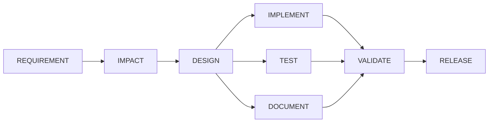

# Design: architecture, testing, limitations and trade-offs

This document merges architecture, the testing approach, and limitations and trade-offs
into one place, per spec 09's reduced scope. For the day-by-day record of specific design
mistakes and fixes as the build actually happened, see [decisions.md](decisions.md); this
document is the synthesized, current-state view.

## 1. Architecture

### 1.1 The one design principle

Agents propose, deterministic code decides. An LLM (`AnthropicClient`, called through
`java.net.http.HttpClient`, zero SDK) writes specs, code, tests and docs when a node
calls it. The orchestrator itself never trusts what comes back: every claim an agent
makes is checked by code that actually runs; every artifact an agent claims to have
written is read back off disk, not taken on faith.

### 1.2 The graph

`WorkflowNode` (id, executor, `dependsOn`, entry/exit gate names, risk level, max
attempts, `writePaths`) is an immutable record with no status field. `WorkflowGraph`
computes topological order once at construction and validates it (no cycles, no
duplicate ids, every `dependsOn` target exists), then answers "which nodes are ready"
against whatever status map it is handed. Status itself lives in `WorkflowState`, keyed
by node id, not on the node object, specifically so a graph built from a fresh JSON parse
and a state restored from a checkpoint can agree about a node's status without needing to
be the same object instances.

The real eight-node graph (`workflows/sdlc-default.json`):



A second, smaller graph (`workflows/approval-demo.json`, REQUIREMENT then DOCUMENT) exists
specifically because spec 05's real target was proving cross-process resume, not the full
pipeline; see 1.6 and section 3 for why the CLI still defaults to this smaller graph.

### 1.3 The scheduling loop

`WorkflowEngine.run()`: ask the graph for ready nodes; if none and every node is
COMPLETED, the workflow is COMPLETED; if none and some node is WAITING_APPROVAL, the
workflow is AWAITING_APPROVAL (persist and return, a pause, not a failure); if none and
work remains, SAFE_STOPPED, naming the blocked nodes; otherwise submit every ready node
to its own virtual thread, wait for the whole wave, then loop. An iteration guard turns a
theoretical infinite loop into a distinct, named SAFE_STOP reason rather than a silent
hang.

Each node in a wave passes through, in order: its entry gate (a scheduling question, since
a failed entry gate leaves the node PENDING and consumes no retry attempt), a
pre-execution policy check (approval-required and CRITICAL/HIGH-risk rules), the
executor itself, a post-execution policy check (write-paths, protected-paths, secrets,
dependency additions, change budget: anything that needs to see what was actually
written), and finally its exit gate. An executor's own `executorReportedSuccess` never
decides the outcome by itself; only the exit gate does, which is what makes "no hardcoded
agent responses" (CLAUDE.md rule 2) enforceable rather than aspirational: a canned
success string still has to survive a gate that reads real files.

### 1.4 Retries, fallback, rollback, safe-stop

A failed exit gate retries the same executor, with the failure reason and attempt number
threaded into context, up to the node's declared `maxAttempts`. Exhausting the budget
either runs a declared `fallbackExecutor` once (a materially different strategy, not
another retry) or triggers rollback: `Checkpoint.take` snapshotted the node's declared
`writePaths` before its first attempt, and `Checkpoint.restore` copies that snapshot back
and verifies every restored file's content hash, so "rollback happened" is something the
audit log can back up by pointing at a file, not just a status label. A rollback or an
exhausted retry budget with no fallback both set `safeStopRequested`, which surfaces as
SAFE_STOPPED once the current wave finishes.

### 1.5 Policy, approvals, and audit

`RealPolicyEngine` loads named, data-driven rules from `workflows/policy.json` (nothing
compiled into the rule thresholds themselves) and evaluates them in two passes:
pre-execution (`critical-risk-requires-approval`, `high-risk-requires-approval`) and
post-execution (`protected-paths-global`, `write-paths-contract`, `no-secrets-in-diff`,
`no-dependency-additions`, `change-budget`), the split existing because several rules
genuinely cannot be evaluated until an executor has reported what it wrote. A DENY
records a real `POLICY_DENIED` audit event, fails the node, and rolls it back exactly as
an exhausted retry budget would; a REQUIRE_APPROVAL parks the node at WAITING_APPROVAL
using only legal transitions the state machine's own table allows (PENDING to
WAITING_APPROVAL, never RUNNING to WAITING_APPROVAL, since approving something already
half-executed is not a gate, it is a formality). `ApprovalStore` keys a granted approval
to `(nodeId, requirementRevision)`, so a re-plan that bumps the revision silently
invalidates every approval recorded against the prior one without `Replanner` needing to
touch `ApprovalStore` at all.

Every status change flows through `WorkflowState.transition`, which is the only place an
`AuditEvent` is constructed from an observed `from`/`to` pair; nothing in this codebase
builds an `AuditEvent` describing behavior that did not just happen (CLAUDE.md rule 1).
`WorkflowState.toJsonString()`/`fromJsonString()` round-trip the entire run (nodes,
statuses, audit log, evidence, decisions, retry counts) to `runs/<runId>/state.json`
after every wave, which is what makes resuming a paused run in a fresh process (`resume`,
`approve`) possible at all: a resumed run's `WorkflowGraph` and `WorkflowState` are
rebuilt from that file, not carried over in memory.

### 1.6 The agent boundary

`AgentClient` is the seam: `AnthropicClient` makes one real HTTP call per invocation
(never retries internally, since the engine's own retry loop already re-runs a whole
node), `RecordingClient` wraps a real client and caches every request/response pair to
`fixtures/<scenario>/<stage>/<hash>.json` keyed by a hash of the full request body, and
`ReplayClient` serves from that cache with no network at all. `--replay` (the default)
and `--live` differ only in which of these three compositions `AgentClientFactory`
builds; no executor or gate knows or cares which one it is talking to. This is what makes
a fresh clone's demo runs byte-identical for every evaluator, key or no key.

Cross-stage context threading (a design spec reaching `ImplementExecutor`, a real diff
reaching `DocumentExecutor`) is real but only fully wired through the CLI for the
two-node demo graph; see section 3.1 for exactly what this costs the full eight-node
pipeline today.

## 2. Testing approach

The orchestrator has zero external dependencies by design (no Maven, no Gradle, no
JUnit), so its own test suite is a hand-rolled `TestRunner` (`orchestrator/src/test`)
that discovers every `test*` method by reflection and reports PASS/FAIL, run by
`./scripts/test.sh` after compiling main and test sources together with `javac`. There
is no mocking framework: a "mock" in this codebase is a real, small, hand-written class
(`MutableClock` in target-service's tests, `ControllableExecutor`, `FakeAgentClient`)
that implements a real interface with controllable, real behavior, not a
call-recording stub.

Three layers:

- **Unit tests** against a single class's real logic: `WorkflowGraphTest`,
  `NodeStatusTransitionTest` (all 81 ordered status pairs, not a sample), `PolicyEngineTest`
  (one test per rule, each proving the restrictive branch actually fires against a
  constructed `WorkflowNode`/`WorkflowState`), `RunMetricsTest` (every metric against a
  hand-built `state.json` fixture on disk, never a live run).
- **Engine-level integration tests** (`WorkflowEngineTest`, `CheckpointTest`,
  `ReplannerTest`) that run a real `WorkflowEngine` with `ControllableExecutor` (a
  test-only `NodeExecutor` that writes real files and can be configured to fail N times
  then succeed, kept under `src/test` specifically so no real workflow JSON can ever
  reference it by name), asserting on real file contents and real audit events, not just
  final status.
- **Cross-process and end-to-end tests** (`MainCliResumeTest`,
  `MainCliFullPipelineTest`, `GreenfieldEndToEndTest`) that shell out to a real
  `java -cp ... com.schwab.agentic.cli.Main` subprocess or chain real recorded fixtures
  through real executors end to end, proving resume genuinely survives a process
  boundary and that a full pipeline's real agent outputs actually compile and pass real
  tests, not just that JSON round-trips.

A recurring project convention, applied throughout: verify a test non-vacuously by
deliberately breaking the mechanism it claims to test, confirming that specific test (and
only that test) fails, then restoring the fix. This caught, among others, a wrong
`ConcurrentHashMap` assumption in checkpoint-handling under real concurrent access
(`testTwoParallelNodesWithDisjointWritePathsRollBackIndependently`) and a criterion-id
regex that silently over-matched in `TestExecutor`.

`target-service` (Spring Boot) tests separately, against H2 in `MODE=PostgreSQL` with a
per-vendor Flyway migration split (`db/migration/postgresql/` vs `db/migration/h2/`,
since H2 rejects Postgres's `DEFAULT nextval(...)` syntax), so its own suite needs
neither Docker nor Testcontainers: `./gradlew test` from `target-service/` is the exact
command the orchestrator's `CommandRunner` shells out to.

## 3. Limitations

Ordered roughly by how much they currently constrain what a reviewer can see run for
real, not by discovery order.

### 3.1 A real CLI wiring gap silently blocked two of the three scenarios (found and fixed late, in spec 09)

`Main.java`'s `buildEngine` hardcoded `fixtures/cli/requirement` as the REQUIREMENT
executor's fixture lookup directory, regardless of which scenario's `requirement.md` was
actually being run. `fixtures/cli/requirement`'s recorded response only matches
`greenfield`'s exact requirement text (by request hash), so `./scripts/run.sh
brownfield` or `./scripts/run.sh ambiguous` threw `MissingFixtureException` at
REQUIREMENT on the very first attempt, every time, for as long as this bug existed: those
two scenarios could never complete a CLI run at all, real open-questions detection or
not. This was a real, pre-existing defect (present since spec 05 first wrote `Main.java`
this way), not something introduced by spec 09; it only surfaced now because spec 09 was
the first spec to actually run all three scenarios through the CLI for real rather than
through direct executor unit tests.

**Fix.** `buildEngine` now derives the REQUIREMENT executor's fixture subdirectory from
the real `requirement.md` file's parent directory name (`scenarioNameFrom`), so
`brownfield`'s run reads `fixtures/brownfield/requirement` and `ambiguous`'s reads
`fixtures/ambiguous/requirement`. The two-node demo graph (`approval-demo.json`,
detected by the absence of a `DESIGN` node, since it is not itself scenario-shaped) is
special-cased to keep using the paired `fixtures/cli/{requirement,document}` fixtures
regardless of which scenario name is passed, since those two fixtures were recorded
against each other specifically and swapping REQUIREMENT's half for a different
scenario's real text would desynchronize them from DOCUMENT's recorded response.
Verified via `MainCliResumeTest` (unaffected, still passing) and the full suite
(159/166, identical failure set to before the fix, described below).

### 3.2 Fixtures are replay-by-default; live re-recording is real, but currently blocked by both credit and a code-shape change

Live mode is fully implemented and was used for real at least once: `docs/decisions.md`'s
D6-D7 entries document a real, successful `--live` recording pass (10 fixtures, real
model calls, real compile failures found and fixed, real hallucinated dependencies
found and fixed) that reached a real, replayable `RELEASE COMPLETED` for the greenfield
scenario through the full eight-node graph.

That state has since regressed, for two independent, understood reasons, both currently
blocking re-recording:

1. **No credit.** `AnthropicClientTest.testLiveCallAgainstTheRealApiReturnsText`
   currently fails against the real API with `"Your credit balance is too low to access
   the Anthropic API"`, confirmed directly, not inferred.
2. **Spec 07's target-service restructure changed IMPACT's real file inventory.**
   `ImpactExecutor`'s prompt includes a real listing of `target-service`'s files; moving
   every file into layered packages (`controller/`, `service/`, `repository/`, etc.) for
   spec 07 changed that inventory, which changes the request hash IMPACT looks up under
   replay. This currently fails `greenfield/impact`'s fixture lookup, which cascades:
   `IMPLEMENT`, `TEST`, and `DOCUMENT` all depend on IMPACT's real output for their own
   context, so their fixtures fail too, for the same underlying reason, not four
   independent breaks.

Current, verified failure set (7 of 166 tests, `./scripts/test.sh`), all attributable to
exactly these two causes:

```
AnthropicClientTest.testLiveCallAgainstTheRealApiReturnsText           (no credit)
GreenfieldEndToEndTest.testFullGreenfieldPipelineReachesRealReleaseCompleted   (stale IMPACT fixture)
GreenfieldEndToEndTest.testRealImpactFixturesReplayAndWriteNonEmptyArtifacts   (stale IMPACT fixture)
GreenfieldEndToEndTest.testRealImplementFixtureReplaysAndProducesRealCompilingSource  (downstream of IMPACT)
GreenfieldEndToEndTest.testRealTestFixtureReplaysAndPassesAfterTheRealRetry    (downstream of IMPACT)
GreenfieldEndToEndTest.testRealDocumentFixtureReplaysAndWritesNonEmptyArtifacts (downstream of IMPACT)
MainCliFullPipelineTest.testRunReachesCompletedWithAllEightNodesCompletedAcrossARealCliSubprocess (same)
```

Separately, and unrelated to spec 07: the retry-path fixtures for all three scenarios'
REQUIREMENT node were recorded before a later fix changed the retry-reason text embedded
in the retry prompt (from a non-reproducible temp path to the actual open-questions
text). The run's real, current terminal status (`SAFE_STOPPED`) is not itself evidence of
a clean stop on ambiguity: it is reached because attempt 1 correctly detects open
questions and fails its exit gate (real, designed behavior), and the automatic retry that
follows immediately **crashes** with a real `MissingFixtureException` (an unhandled
exception inside `runAttemptsUntilOutcome`, caught by `executeOneNode`'s own
catch-and-fail path, which is what actually produces the `SAFE_STOPPED` status), in all
three committed scenario runs under `runs/`. The first-attempt mechanism, a correct,
designed safe-stop trigger on real unanswered questions, is real and worth citing on its
own; the crash immediately after it is the credit-blocked part, and the two should not be
described as one continuous clean stop.

The fix for both is the same command, once credit is available:
`java -cp orchestrator/out com.schwab.agentic.tools.FixtureRecorder`, which supports
`--only-*` flags so re-recording only the affected stages does not re-spend credit on
stages that are still correct.

### 3.3 A two-hour connection stall led to the request timeout now in `AnthropicClient`

An earlier live session against the real Anthropic API stalled for roughly two hours on
what should have been a single request, with no response and no error, consuming wall
clock time with nothing to show for it and no way to distinguish "still working" from
"never going to return." `AnthropicClient` did not originally configure a request
timeout at all, only a 30-second connection timeout; a slow or hung connection past that
point could block indefinitely. Fixed by adding an explicit
`.timeout(Duration.ofMinutes(5))` to every request, so a stalled call now fails loudly
and promptly as a real `AgentCallException` instead of hanging the whole run.

### 3.4 Cross-stage context threading is not wired into the CLI for the full eight-node graph

The real design spec reaching `ImplementExecutor`, and the real diff reaching
`DocumentExecutor`, both happen correctly today, but only inside `FixtureRecorder` (the
standalone live-recording tool) and inside the direct executor unit tests that construct
this context by hand. `Main.java`'s CLI wires this threading for the two-node demo graph
only (`WorkflowEngine.withInitialContext`, seeded per node in `buildEngine`); running the
real `sdlc-default.json` graph through the CLI end to end needs the same threading
extended to IMPACT, DESIGN, TEST, and DOCUMENT's real upstream dependencies. This is a
named, deliberate scope decision from spec 05 (proving cross-process resume did not need
the full pipeline wired), not an oversight discovered late, and it is why the CLI's own
quickstart command in the README runs the small demo graph by default.

### 3.5 Structural limitations, not currently blocking anything, but real

- **Single-process execution.** `WorkflowEngine` schedules within one JVM using virtual
  threads; there is no distributed locking or multi-node coordination, so two processes
  cannot safely run the same `runId` concurrently.
- **Graph structure is fixed at re-plan time.** `Replanner` invalidates and re-runs
  existing nodes along the downstream closure of a changed node; it cannot add or remove
  nodes from the graph itself mid-run.
- **Checkpoints are filesystem copies, not a VCS-level mechanism.** `Checkpoint.take`
  copies real files to `runs/<runId>/checkpoints/<label>/` and verifies restoration by
  content hash; it is not git-backed, has no history beyond the single most recent
  checkpoint per node, and does not deduplicate content across nodes or runs.
- **No cost ceiling enforcement.** Nothing in the policy engine currently caps total
  agent-call spend for a run; a runaway retry loop against a real `--live` model would
  keep spending until its retry budget or safe-stop condition is reached, not a dollar
  figure.
- **Agent output quality varies by model version and prompt phrasing.** D9 in
  `decisions.md` documents a real instance of this: a live model's first attempt
  imported dependencies (`Caffeine`, `Jsoup`, a Redis client) that do not exist in
  `target-service`'s real dependency graph, fixed by naming the real and unavailable
  dependencies explicitly in the prompt rather than by loosening any gate.
- **Replay fixtures are point-in-time.** A fixture is a snapshot of one real model
  response at one moment; it does not update itself when the target codebase, the
  prompt, or the model changes, which is the root cause of section 3.2 above.

## 4. Trade-offs, stated plainly

- **The CLI's default demo graph is small (two nodes) on purpose**, not because the
  eight-node graph does not work: spec 05 needed to prove cross-process resume, which
  does not require the full pipeline, and building the full pipeline's context-threading
  was explicitly deferred rather than half-built under a different spec's time budget.
- **A real, live, successful full pipeline run happened once** (D7) and is not
  reproducible from a fresh clone today, because two later, independent, and necessary
  changes (spec 07's restructure, the spec 09 CLI fix) each invalidated a different real
  fixture. The alternative, freezing the target-service structure or the retry-reason
  text to keep old fixtures valid, was rejected: a fixture that constrains real code
  changes is a fixture that has stopped serving its purpose.
- **Rollback restores exactly what a node's own declared `writePaths` covers, nothing
  more.** `runs/POLICY-DENIAL-DEMO`'s demonstration executor both modifies a real,
  pre-existing file inside its declared `writePaths` and writes a second file outside
  them; rollback restores the first (a genuine, content-hash-verified `restored 1
  file(s)`, not a claimed one) but never touches the second, since that write's own
  checkpoint was never scoped to protect or restore a path it was never told to watch.
  Policy denies and safe-stops the run, but does not itself clean up the escaping write.
  This is a deliberate, narrow checkpoint scope (so two nodes with disjoint `writePaths`
  can roll back independently, per D2), not a rollback bug, and it is exactly what makes
  `write-paths-contract` a security boundary worth having rather than a formality: a
  checkpoint cannot be relied on to undo a write it was never told to watch, which is why
  the policy denial, not the checkpoint, is the control actually doing the work here.
