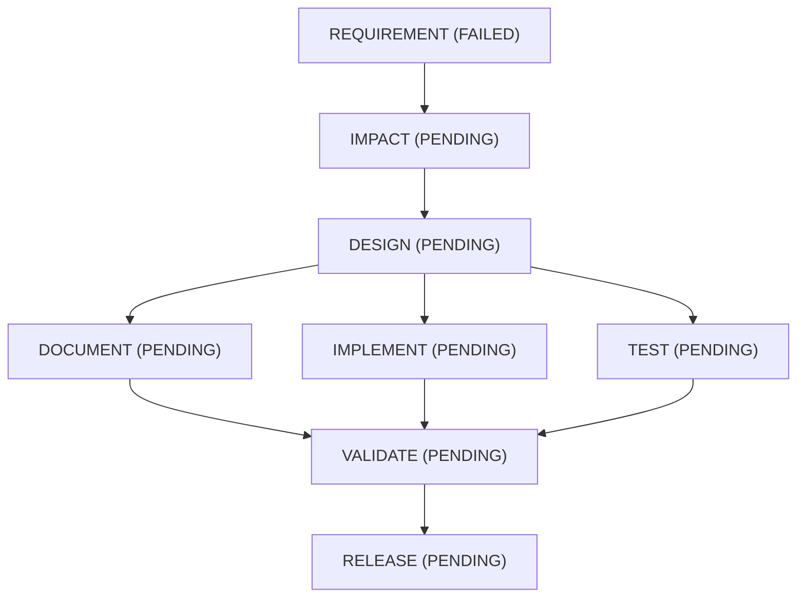

# Run report: BROWNFIELD-DEMO

## Metrics

| Metric | Value |
|---|---|
| Success rate | 0.0% |
| Total retries | 1 |
| Retry frequency (per attempted node) | 1.00 |
| Rollback count | 0 |
| Rollback frequency (per node) | 0.00 |
| End-to-end latency | 0.230s |
| MTTR | null (no node needed more than one attempt) |
| Unrecovered nodes (failed, never later completed) | REQUIREMENT |

## Workflow graph

## Traceability matrix

| Criterion | Evidence | Origin | Passed | Artifact |
|---|---|---|---|---|
