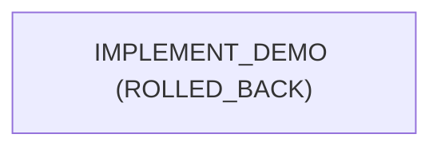

# Run report: POLICY-DENIAL-DEMO

## Metrics

| Metric | Value |
|---|---|
| Success rate | 0.0% |
| Total retries | 0 |
| Retry frequency (per attempted node) | 0.00 |
| Rollback count | 1 |
| Rollback frequency (per node) | 1.00 |
| End-to-end latency | 0.084s |
| MTTR | null (no node needed more than one attempt) |
| Unrecovered nodes (failed, never later completed) | IMPLEMENT_DEMO |

## Workflow graph

## Traceability matrix

| Criterion | Evidence | Origin | Passed | Artifact |
|---|---|---|---|---|
| AC-POLICY-DENIAL-1 | (none) | | | |
